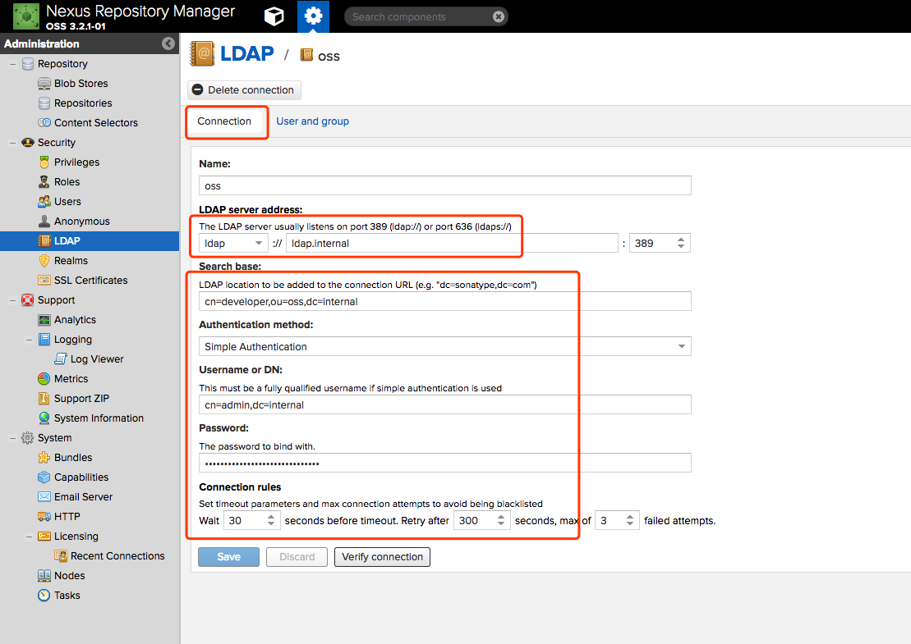
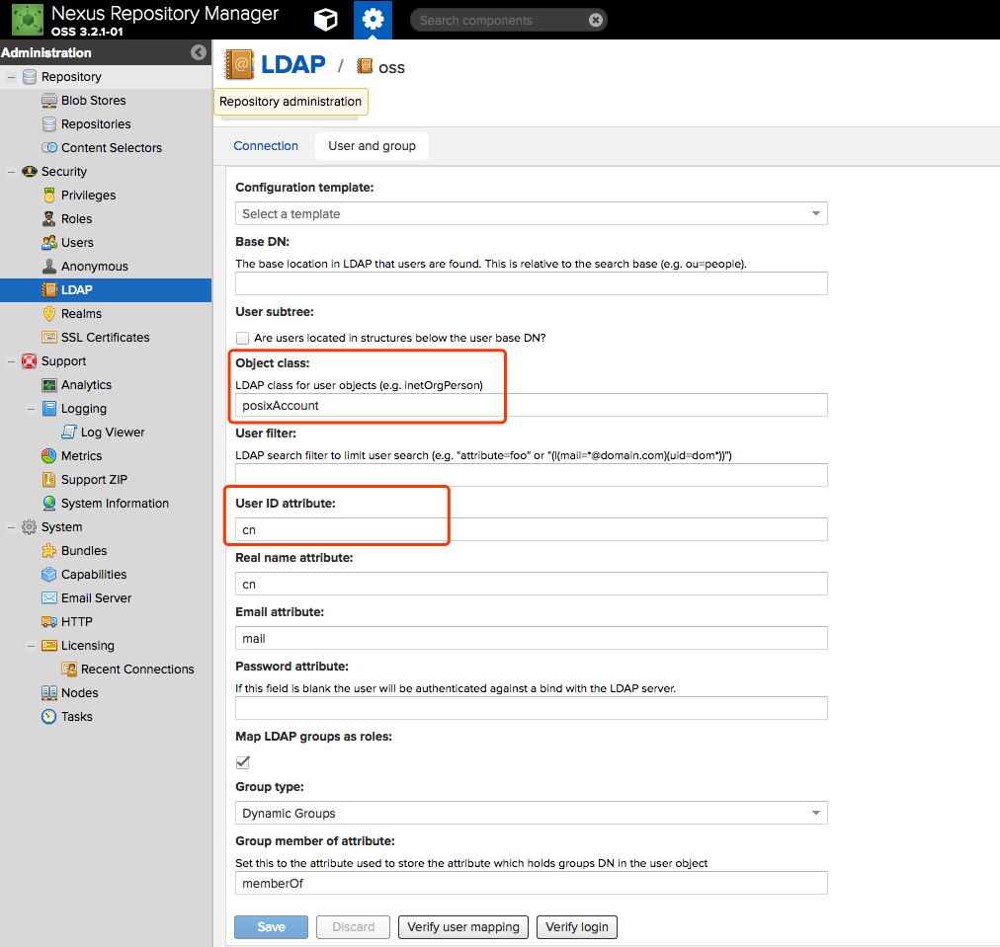

# docker-nexus3
An auto configured nexus3

## Nexus3 Without SSL:

Environment variables

  Local nexus3 can set up a company's internal nexus2 or nexus3 as upstream

    export INFRASTRUCTURE_INTERNAL_NEXUS3=<http://nexus3.internal:28081>
  or
    export INFRASTRUCTURE_INTERNAL_NEXUS2=<http://nexus2.internal:28081>

Build

    docker-compose build

Start

    docker-compose up -d

## Note

Default admin username/password is: admin/admin123
Default deploy (in maven's settings.xml) username/password is: deployment/deployment

Do not use NFS on nexus3.

## LDAP

1. Make sure DNS is ok, LDAP server is accessible from nexus3.

2. LDAP connection

3. LDAP user and group

## Use as npm registry:

    npm config set registry http://nexus3.local:28081/nexus/repository/npm-public/
    npm config set cache ${HOME}/.npm/.cache/npm
    npm config set disturl http://nexus3.local:28081/nexus/repository/npm-dist/
    npm config set sass_binary_site http://nexus3.local:28081/nexus/repository/npm-sass/

cat or edit '~/.npmrc':

    registry = http://localhost:8081/nexus/repository/npm-public/

Publish into registry

    npm login --registry=http://nexus3.local:28081/nexus/repository/npm-hosted/
    npm --loglevel info install -g bower
    npm publish --registry http://nexus3.local:28081/nexus/repository/npm-hosted/
    or "publishConfig" : {"registry" : "http://nexus3.local:28081/nexus/repository/npm-hosted/"},
    npm deprecate --registry http://nexus3.local:28081/nexus/repository/npm-hosted/ testproject1@0.0.1 "This package is deprecated"

## Use as bower registry:

    npm install -g bower && npm install -g bower-nexus3-resolver

projectRoot/.bowerrc

    {
    "registry" : {
      "search" : [ "http://nexus3.local:28081/nexus/repository/bower-public" ],
      "register" : "http://nexus3.local:28081/nexus/repository/bower-hosted"
    },
    "resolvers" : [ "bower-nexus3-resolver" ],
    "nexus" : {"username" : "deployment","password" : "deployment"}
    }

projectRoot/package.json

    "devDependencies" : {"bower-nexus3-resolver" : "*"}

    bower install jquery
    bower register example-package git://gitserver/project.git
    bower install example-package

## Use as Docker registry and mirror

Issue: Must login (even read only access) before use.
see: [add anonymous read access support for docker repositories](https://issues.sonatype.org/browse/NEXUS-10813)

Login

    docker login -u deployment -p deployment registry.docker.local
    docker login -u deployment -p deployment registry.docker.local:5000
    docker login -u deployment -p deployment registry.docker.local:5002
    docker login -u deployment -p deployment registry.docker.local:5003
    cat ~/.docker/config.json

    docker search registry.docker.local/alpine
    docker pull registry.docker.local/alpine
    docker tag nginx:1.11.5-alpine registry.docker.local:5000/nginx:1.11.5-alpine
    docker push registry.docker.local:5000/nginx:1.11.5-alpine
    
    # Test docker mirror of gcr.io
    docker pull mirror.docker.local/google_containers/kube-dnsmasq-amd64:1.4
    curl http://mirror.docker.local/v2/_catalog
    curl http://mirror.docker.local/v2/google_containers/kube-dnsmasq-amd64/tags/list

## TODO

Use the official REST API to interact with nexus3

see: http://books.sonatype.com/nexus-book/reference3/scripting.html

### TODO Nexus3 With SSL:

see: https://books.sonatype.com/nexus-book/3.0/reference/security.html#ssl-inbound
see: http://www.eclipse.org/jetty/documentation/current/configuring-ssl.html

keytool -keystore keystore -alias jetty -genkeypair -keyalg RSA \
-storepass changeit -keypass changeit -keysize 2048 -validity 5000 \
-dname "CN=*.${NEXUS3_DOMAIN}, OU=Example, O=Sonatype, L=Unspecified, ST=Unspecified, C=US" \
-ext "SAN=DNS:${NEXUS3_DOMAIN},IP:${NEXUS_IP_ADDRESS}" -ext "BC=ca:true" \

keytool -keystore keystore -alias jetty -genkey -keyalg RSA -sigalg SHA256withRSA -ext 'SAN=dns:jetty.eclipse.org,dns:*.jetty.org'

## References

see: https://github.com/clearent/nexus
see: https://github.com/sonatype/docker-nexus3/blob/master/Dockerfile
see: http://www.sonatype.org/nexus/2015/09/22/docker-and-nexus-3-ready-set-action/
see: http://codeheaven.io/using-nexus-3-as-your-repository-part-3-docker-images/
